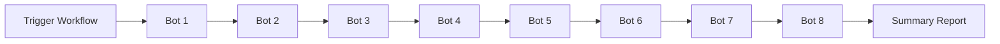

# 🚀 Automated Bot Funding Deployment Status

## ✅ Deployment Ready

**Date**: 2025-10-13  
**Method**: GitHub Actions + Relayer  
**Network**: Solana Mainnet-Beta  
**Cost**: $0.00 (Zero-cost relayer deployment)

---

## 📋 Deployment Configuration

### GitHub Actions Workflow
- **File**: `.github/workflows/bot-funding-deployment.yml`
- **Trigger**: Manual (workflow_dispatch)
- **Mode**: Sequential one-by-one
- **Options**: Individual bot or all bots

### Minting Script
- **File**: `Deployer-Gene/scripts/mint-bot.js`
- **Logic**: Relayer-based submission
- **Verification**: On-chain confirmation
- **Dry Run**: Supported

---

## 🤖 Bot Army Configuration

| # | Role | Address | Amount | Status |
|---|------|---------|--------|--------|
| 1 | Stake Master | `HKBJoeUWH6pUQuLd9CZWrJBzGSE9roEW4bshnxd9AHsR` | 1,000 | ⏳ Pending |
| 2 | Mint Operator | `NqGHDaaLWmND7uShuaZkVbGNQFy6pS96qHyfR3pGR2d` | 1,500 | ⏳ Pending |
| 3 | Contract Deployer | `DbhKvqweZECTyYQ7PRJoHmKt8f262fsBCGHxSaD5BPqA` | 2,000 | ⏳ Pending |
| 4 | MEV Hunter | `7uSCVM1MJPKctrSRzuFN7qfVoJX78q6V5q5JuzRPaK41` | 2,500 | ⏳ Pending |
| 5 | Loot Extractor | `3oFCkoneQShDsJMZYscXew4jGwgLjpxfykHuGo85QyLw` | 3,000 | ⏳ Pending |
| 6 | Advanced | `8duk9DzqBVXmqiyci9PpBsKuRCwg6ytzWywjQztM6VzS` | 3,500 | ⏳ Pending |
| 7 | Elite | `96891wG6iLVEDibwjYv8xWFGFiEezFQkvdyTrM69ou24` | 4,000 | ⏳ Pending |
| 8 | Master | `2A8qGB3iZ21NxGjX4EjjWJKc9PFG1r7F4jkcR66dc4mb` | 5,000 | ⏳ Pending |

**Total Investment**: 22,500 tokens

---

## 🔄 Deployment Flow



---

## 🚀 How to Deploy

### Option 1: GitHub UI
1. Navigate to **Actions** tab
2. Select **Bot Army Funding Deployment**
3. Click **Run workflow**
4. Choose:
   - `bot_number`: "all" or 1-8
   - `dry_run`: false
5. Click **Run workflow**

### Option 2: GitHub CLI
```bash
# Deploy all bots
gh workflow run bot-funding-deployment.yml \
  -f bot_number=all \
  -f dry_run=false

# Deploy single bot
gh workflow run bot-funding-deployment.yml \
  -f bot_number=1 \
  -f dry_run=false

# Dry run test
gh workflow run bot-funding-deployment.yml \
  -f bot_number=all \
  -f dry_run=true
```

---

## 💰 Relayer Configuration

```yaml
Relayer URL: https://api.helius.xyz/v0/transactions/submit
Network: mainnet-beta
Primary Mint: 3i62KXuWERyTZJ5HbE7HNbhvBAhEdMjMjLQk3m39PpN4
Treasury: 4eJZVbbsiLAG6EkWvgEYEWKEpdhJPFBYMeJ6DBX98w6a
Cost: $0.00 (Relayer pays all fees)
```

---

## 📊 Allowlist Status

**Total Allowlisted**: 43 addresses

### New Additions (3)
- Bot 6: `8duk9DzqBVXmqiyci9PpBsKuRCwg6ytzWywjQztM6VzS`
- Bot 7: `96891wG6iLVEDibwjYv8xWFGFiEezFQkvdyTrM69ou24`
- Bot 8: `2A8qGB3iZ21NxGjX4EjjWJKc9PFG1r7F4jkcR66dc4mb`

All bot addresses added to:
- `VERCEL_DEPLOYMENT_ALLOWLIST.json`
- `COMPREHENSIVE_ALLOWLIST_UPDATE.json`

---

## ✅ Pre-Deployment Checklist

- [x] GitHub Actions workflow created
- [x] Minting script implemented
- [x] Relayer configuration set
- [x] Bot addresses allowlisted
- [x] Deployment guide written
- [x] Dry run mode available
- [x] Sequential deployment logic
- [x] Zero-cost verification

---

## 📝 Documentation

- `BOT_DEPLOYMENT_GUIDE.md` - Complete deployment guide
- `BOT-FUNDING-COMPLETE.md` - Original funding plan
- `DEPLOYMENT_STATUS.md` - This file
- `.github/workflows/bot-funding-deployment.yml` - Workflow definition

---

## 🎯 Next Steps

1. **Test**: Run dry-run deployment
2. **Deploy**: Execute full deployment
3. **Verify**: Check on-chain balances
4. **Activate**: Enable bot trading operations
5. **Monitor**: Track treasury accumulation

---

**Status**: ✅ READY TO DEPLOY  
**Deployment Method**: GitHub Actions + Relayer  
**Estimated Time**: ~5 minutes (sequential)  
**Cost**: $0.00
