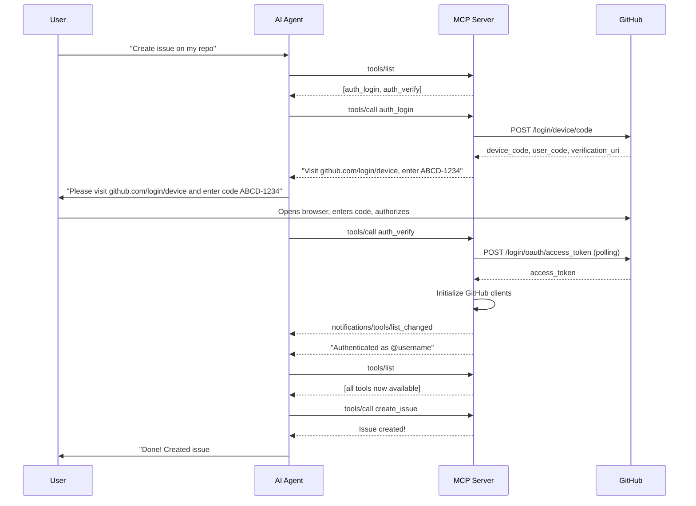

# OAuth Device Flow Authentication Design

## Overview

This document describes the implementation of OAuth Device Flow authentication for the GitHub MCP Server's stdio transport. The design enables users to authenticate without pre-configuring tokens, making setup significantly simpler.

## Problem Statement

Currently, users must:
1. Generate a Personal Access Token (PAT) manually on GitHub
2. Configure the token in their MCP host's configuration (often in plain text)
3. Manage token rotation manually

This creates friction for new users and security concerns around token storage.

## Proposed Solution

When the server starts without a `GITHUB_PERSONAL_ACCESS_TOKEN`, instead of failing, it starts in "unauthenticated mode" with only authentication tools available. Users authenticate through MCP tool calls:

1. **`auth_login`** - Initiates device flow, returns verification URL and user code
2. **`auth_verify`** - Completes the flow after user authorizes in browser

Once authenticated, the token is held in memory for the session and all regular tools become available.

## User Experience

### Before (Current)
```jsonc
{
  "githubz": {
    "command": "docker",
    "args": ["run", "--rm", "-e", "GITHUB_PERSONAL_ACCESS_TOKEN", "ghcr.io/github/github-mcp-server"],
    "env": {
      "GITHUB_PERSONAL_ACCESS_TOKEN": "${input:github_token}"  // User must create PAT first
    }
  }
}
```

### After (New)
```jsonc
{
  "github": {
    "command": "docker", 
    "args": ["run", "--rm", "-i", "ghcr.io/github/github-mcp-server", "stdio", "--toolsets=all"]
    // No token needed! User authenticates via tool call
  }
}
```

### Authentication Flow (User Perspective)

1. User asks agent: "Create an issue on my repo"
2. Agent calls `auth_login` tool
3. Tool returns:
   ```
   To authenticate, visit: https://github.com/login/device
   Enter code: ABCD-1234
   
   After authorizing, use the auth_verify tool to complete login.
   ```
4. User opens browser, enters code, clicks "Authorize"
5. Agent calls `auth_verify` tool
6. Tool returns: "Successfully authenticated as @username"
7. Agent proceeds with original request using now-available tools

## Technical Design

### Architecture

```
┌─────────────────────────────────────────────────────────────────┐
│                        MCP Server                                │
├─────────────────────────────────────────────────────────────────┤
│                                                                  │
│  ┌──────────────┐    ┌──────────────┐    ┌──────────────────┐  │
│  │ Auth State   │───▶│ Tool Filter  │───▶│ GitHub Clients   │  │
│  │ Manager      │    │              │    │ (lazy init)      │  │
│  └──────────────┘    └──────────────┘    └──────────────────┘  │
│         │                                         │              │
│         │ token                                   │              │
│         ▼                                         ▼              │
│  ┌──────────────┐                        ┌──────────────────┐  │
│  │ Device Flow  │                        │ REST/GraphQL     │  │
│  │ Handler      │                        │ Clients          │  │
│  └──────────────┘                        └──────────────────┘  │
│                                                                  │
└─────────────────────────────────────────────────────────────────┘
```

### State Machine

```
┌─────────────────┐
│ UNAUTHENTICATED │ ◀──────────────────────────────┐
│                 │                                 │
│ Tools: auth_*   │                                 │
└────────┬────────┘                                 │
         │ auth_login()                             │
         ▼                                          │
┌─────────────────┐                                 │
│ PENDING_AUTH    │                                 │
│                 │──── timeout/error ─────────────▶│
│ Tools: auth_*   │                                 │
└────────┬────────┘                                 │
         │ auth_verify() success                    │
         ▼                                          │
┌─────────────────┐                                 │
│ AUTHENTICATED   │                                 │
│                 │──── token invalid ─────────────▶│
│ Tools: all      │                                 │
└─────────────────┘
```

### Host URL Derivation

For different GitHub products, device flow endpoints are derived from the configured host:

| Product | Host Config | Device Code Endpoint |
|---------|-------------|---------------------|
| github.com | (default) | `https://github.com/login/device/code` |
| GHEC | `https://tenant.ghe.com` | `https://tenant.ghe.com/login/device/code` |
| GHES | `https://github.example.com` | `https://github.example.com/login/device/code` |

### OAuth App Requirements

The device flow requires an OAuth App. Options:
1. **GitHub-provided OAuth App** (recommended) - We register a public OAuth App for this purpose
2. **User-provided OAuth App** - Via `--oauth-client-id` flag for enterprise scenarios

Default OAuth App scopes (matching `gh` CLI minimal scopes):
- `repo` - Full control of private repositories
- `read:org` - Read org membership
- `gist` - Create gists

### Key Components

#### 1. Auth State Manager (`pkg/github/auth_state.go`)

```go
type AuthState struct {
    mu           sync.RWMutex
    token        string
    deviceCode   *DeviceCodeResponse
    pollInterval time.Duration
    expiresAt    time.Time
}

func (a *AuthState) IsAuthenticated() bool
func (a *AuthState) GetToken() string
func (a *AuthState) StartDeviceFlow(ctx context.Context, host apiHost, clientID string) (*DeviceCodeResponse, error)
func (a *AuthState) CompleteDeviceFlow(ctx context.Context) (string, error)
```

#### 2. Auth Tools (`pkg/github/auth_tools.go`)

```go
// auth_login tool - initiates device flow
func AuthLogin(ctx context.Context) (*AuthLoginResult, error)

// auth_verify tool - completes device flow  
func AuthVerify(ctx context.Context) (*AuthVerifyResult, error)
```

#### 3. Dynamic Tool Registration

When unauthenticated, only auth tools are registered. After successful auth:
1. Initialize GitHub clients with new token
2. Register all configured toolsets
3. Send `tools/list_changed` notification to client

### Docker Considerations

With `--rm` containers:
- Token lives only in memory for the session duration
- User re-authenticates each time container starts
- This is acceptable UX since device flow is quick (~30 seconds)

For persistent auth (optional future enhancement):
- Mount a config volume: `-v ~/.config/github-mcp-server:/config`
- Server stores encrypted token in volume
- Requires user opt-in for security

### Security Considerations

1. **Token never in config** - Token obtained at runtime, never written to disk (in --rm mode)
2. **Short-lived session** - Token only valid for container lifetime
3. **Principle of least privilege** - Request minimal scopes
4. **PKCE** - Use PKCE extension for additional security (if supported)
5. **User verification** - User explicitly authorizes in browser with full visibility

### Error Handling

| Scenario | Behavior |
|----------|----------|
| Device flow timeout | Return error, user can retry `auth_login` |
| User denies authorization | Return error explaining denial |
| Network issues during poll | Retry with backoff, eventually timeout |
| Invalid client ID | Clear error message with setup instructions |
| Token expires mid-session | Return 401-like error, prompt re-auth via tools |

## Implementation Plan

### Phase 1: Core Auth Flow
1. Add `pkg/github/auth_state.go` - Auth state management
2. Add `pkg/github/auth_tools.go` - Auth tool implementations
3. Modify `internal/ghmcp/server.go` - Support unauthenticated startup
4. Add device flow endpoint derivation for all host types

### Phase 2: Dynamic Tool Registration
1. Implement `tools/list_changed` notification after auth
2. Add tool filtering based on auth state
3. Update inventory to support dynamic registration

### Phase 3: Polish & Documentation
1. Add comprehensive error messages
2. Update README with new usage
3. Add integration tests
4. Document OAuth App setup for enterprises

## Usage Documentation

### Quick Start (New Users)

```jsonc
// VS Code settings.json or mcp.json
{
  "servers": {
    "github": {
      "command": "docker",
      "args": ["run", "--rm", "-i", "ghcr.io/github/github-mcp-server", "stdio"],
      "type": "stdio"
    }
  }
}
```

Then just ask your AI assistant to do something with GitHub - it will guide you through authentication!

### Native Installation

```bash
# Install
go install github.com/github/github-mcp-server/cmd/github-mcp-server@latest

# Run (will prompt for auth on first GitHub operation)
github-mcp-server stdio
```

### Enterprise (GHES/GHEC)

```jsonc
{
  "servers": {
    "github": {
      "command": "github-mcp-server",
      "args": ["stdio", "--gh-host", "https://github.mycompany.com"],
      "type": "stdio"
    }
  }
}
```

### With Pre-configured Token (Legacy/CI)

```jsonc
{
  "servers": {
    "github": {
      "command": "github-mcp-server",
      "args": ["stdio"],
      "env": {
        "GITHUB_PERSONAL_ACCESS_TOKEN": "ghp_xxxx"
      },
      "type": "stdio"
    }
  }
}
```

## Open Questions

1. **OAuth App ownership** - Should GitHub provide a first-party OAuth App, or require users to create their own?
2. **Token refresh** - Should we support refresh tokens for longer sessions, or is re-auth acceptable?
3. **Scope customization** - Should users be able to request additional scopes via tool parameters?
4. **Persistent storage** - Should we support optional persistent token storage for non-Docker installs?

## Appendix: Device Flow Sequence


