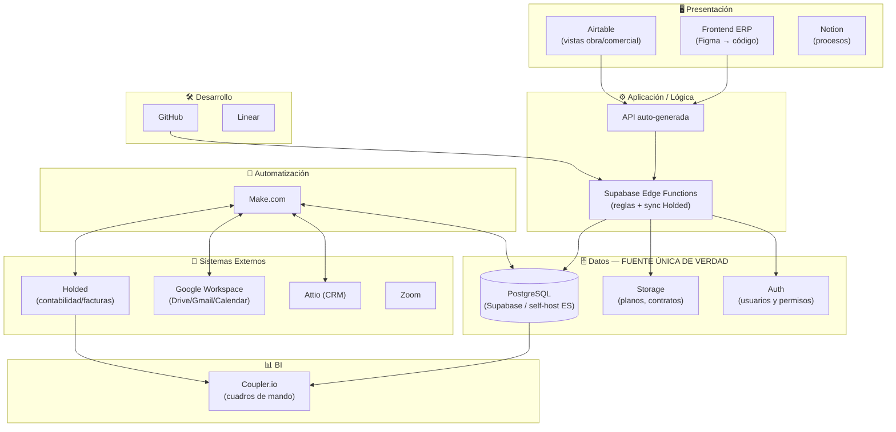
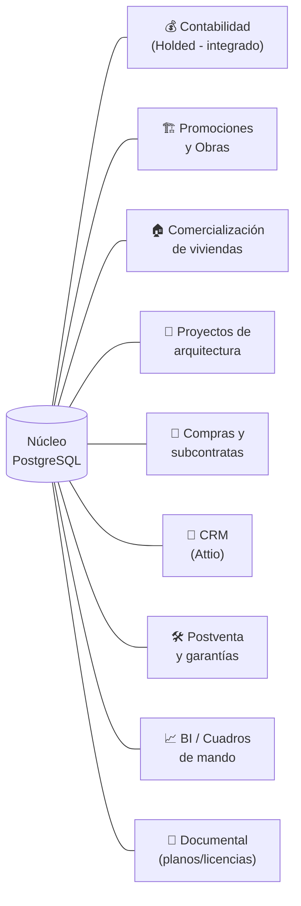

# Arquitectura del ERP — Grupo Tesela

> Documento vivo. v2.
> Sector: **Construcción · Estudio de arquitectura · Promoción inmobiliaria**
> Usuarios objetivo: **10** (arranque por fases, meta a corto plazo: completar **Fase 2**).
> Sistema actual: **Holded** (contabilidad, facturación, CRM básico).

---

## 1. Principios de diseño

1. **Una única fuente de verdad:** los datos del negocio viven en una base de datos central; el resto de herramientas leen/escriben contra ella.
2. **No reinventar lo que ya funciona:** Holded sigue siendo el **motor contable y fiscal** (cumple normativa española: facturación, SII/Verifactu). El ERP nuevo lo **extiende**, no lo reemplaza.
3. **Modular y por fases:** cada módulo se activa cuando toca.
4. **API-first.**
5. **Soberanía del dato:** los datos sensibles (clientes, contratos, compraventas) deben estar en la UE/España.

---

## 2. Stack elegido (decisión tomada)

| Capa | Herramienta | Por qué |
|------|-------------|---------|
| **Contabilidad y facturación (motor fiscal)** | **Holded** (se mantiene) | Ya lo usáis y cumple la normativa fiscal española. Se integra vía su API. |
| **Núcleo de datos del ERP** | **PostgreSQL** (vía Supabase, o self-host en España) | Mejor que MySQL para un ERP: integridad, JSON, extensiones, permisos por fila. Ver §6. |
| **Lógica de negocio / API** | **Supabase Edge Functions** | Reglas del ERP y conexión con Holded. |
| **Automatización principal** | **Make.com** | Sincroniza Holded ⇄ ERP ⇄ resto de apps. |
| **CRM inmobiliario / comercial** | **Attio** | Pipeline de compradores, leads, visitas. |
| **Gestión documental** | **Google Drive** + **Supabase Storage** | Planos, licencias, contratos, escrituras. |
| **Documentación / procesos** | **Notion** | Manual interno, procedimientos de obra. |
| **Datos operativos ligeros** | **Airtable** | Vistas rápidas para obra/comercial sin tocar la BD. |
| **BI / Reporting** | **Coupler.io** | Cuadros de mando (rentabilidad por promoción, tesorería). |
| **Diseño de interfaz** | **Figma** | Frontend del ERP. |
| **Código / CI/CD** | **GitHub** | Versionado y despliegues. |
| **Gestión del desarrollo** | **Linear** | Roadmap del ERP. |
| **Ofimática** | **Google Workspace** | Correo, agenda, Drive (10 usuarios). |
| **Reuniones** | **Zoom** | Comités de obra, reuniones con clientes. |

> **Marketing (Supermetrics):** queda **fuera de las Fases 0–2.** Solo tiene sentido si hacéis inversión publicitaria seria para comercializar promociones. Lo dejamos para más adelante.

---

## 3. Arquitectura por capas

---

## 4. Módulos del ERP (adaptados al sector)

| # | Módulo | Qué cubre | Conectores | Fase |
|---|--------|-----------|-----------|------|
| 1 | **Contabilidad / Facturación** | Asientos, facturas, impuestos | **Holded** (integrado) | F1 |
| 2 | **Promociones y Obras** | Promociones, fases, parcelas/viviendas, certificaciones, control de costes vs presupuesto | Postgres + Airtable | F1–F2 |
| 3 | **Comercialización** | Reservas, arras, contratos de compraventa, estado de cada vivienda | Postgres + Attio | F2 |
| 4 | **Proyectos de arquitectura** | Encargos, fases de diseño, licencias, honorarios | Postgres + Drive | F2 |
| 5 | **Compras y subcontratas** | Proveedores, pedidos, comparativas, certificaciones de subcontrata | Postgres + Holded | F2 |
| 6 | **CRM** | Leads compradores, visitas, seguimiento | Attio | F1–F2 |
| 7 | **Postventa** | Incidencias y garantías de vivienda entregada | Postgres | F3 |
| 8 | **BI / Cuadros de mando** | Rentabilidad por promoción, tesorería, avance de obra | Coupler.io | F2 |
| 9 | **Documental** | Planos, licencias, escrituras, contratos | Drive + Storage | F1 |

---

## 5. Hoja de ruta (objetivo: completar Fase 2)

- **Fase 0 — Cimientos:** decidir BD (§6), montar PostgreSQL + Auth, conectar Holded (lectura), estructura de datos, diseño en Figma.
- **Fase 1 — Núcleo:** Promociones/Obras (base) + Documental + integración Holded + CRM básico (Attio).
- **Fase 2 — Operación (META actual):** Comercialización de viviendas + Compras/subcontratas + Proyectos de arquitectura + BI (Coupler.io).
- **Fase 3 — Más adelante:** Postventa, RRHH, marketing (Supermetrics).

---

## 6. Decisión clave: base de datos ("MySQL de Barcelona")

**Mi recomendación: PostgreSQL, no MySQL.** Para un ERP, Postgres gana en integridad de datos, tipos avanzados (JSON, geolocalización para parcelas), seguridad por fila y extensiones. Tres caminos posibles:

| Opción | Datos en España | Esfuerzo | Recomendación |
|--------|-----------------|----------|---------------|
| **A. Supabase Cloud (región UE)** | UE (no Barcelona exacto) | Mínimo | ✅ La más rápida para arrancar. |
| **B. Supabase self-host en proveedor español (Barcelona)** | Sí, España | Medio | ✅ Si la soberanía del dato es requisito legal. |
| **C. MySQL gestionado en Barcelona** | Sí, España | Alto (perdemos las ventajas de Supabase) | ⚠️ Solo si hay una obligación concreta de usar MySQL. |

> Necesito saber **por qué** estáis mirando "MySQL de Barcelona" (¿soberanía del dato? ¿un proveedor concreto? ¿una recomendación que os han dado?) para cerrar esta decisión.

---

## 7. Integración con Holded

- Holded **no se sustituye.** Sigue siendo el sistema legal de contabilidad y facturación.
- El ERP **lee** de Holded (facturas, cobros, proveedores) vía su API y los cruza con cada promoción para calcular rentabilidad real.
- El ERP **escribe** en Holded cuando proceda (p.ej. generar factura desde un contrato de compraventa) — a través de Make.com.
- Así evitamos duplicar la contabilidad y mantenemos el cumplimiento fiscal.

---

## 8. Pendiente de confirmar

1. **Base de datos:** motivo de "MySQL de Barcelona" → para elegir entre opción A/B/C (§6).
2. **Holded:** ¿se mantiene como motor contable (mi recomendación) o queréis migrar todo al ERP nuevo?
3. ¿Tenéis ya alguna herramienta de gestión de obra/promociones que haya que sustituir o de la que migrar datos?
