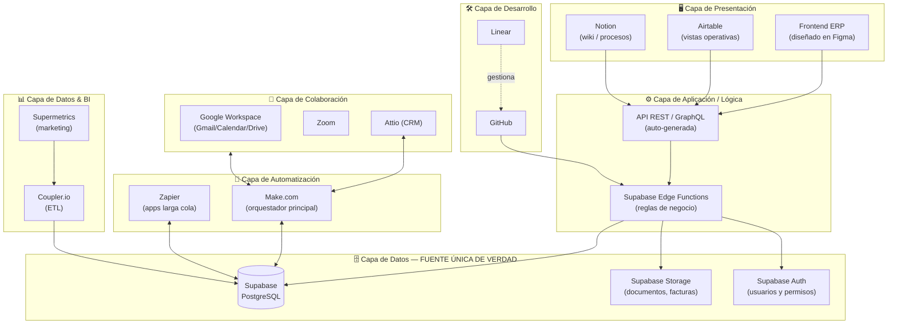
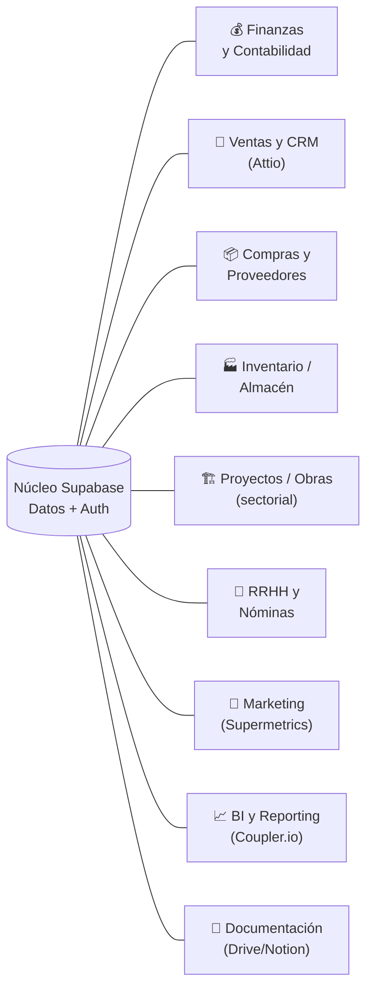

# Arquitectura del ERP — Grupo Tesela

> Documento vivo. Versión inicial del diseño.
> Stack basado en los conectores (MCP) disponibles en el entorno de trabajo.

---

## 1. Principios de diseño

1. **Una única fuente de verdad (single source of truth):** todos los datos del negocio viven en una base de datos central. El resto de herramientas leen/escriben contra ella, nunca al revés.
2. **Modular:** cada área del negocio es un módulo independiente que se puede activar por fases (no hay que construirlo todo de golpe).
3. **Automatización en el centro:** las tareas repetitivas se orquestan, no se hacen a mano.
4. **API-first:** todo expone API para poder conectarlo con cualquier herramienta presente o futura.
5. **Coste escalado:** empezar con el plan gratuito de cada servicio y subir a premium solo cuando el módulo lo justifique.

---

## 2. Stack elegido (decisión tomada)

| Capa | Herramienta elegida | Por qué esta y no otra |
|------|--------------------|------------------------|
| **Núcleo de datos / Backend** | **Supabase** | Postgres real + Auth + API automática + Storage + Edge Functions. Es el corazón del ERP. |
| **Código y CI/CD** | **GitHub** | Repos, ramas, PRs, automatización de despliegues. |
| **Automatización principal** | **Make.com** | Escenarios visuales con lógica compleja. Más potente que Zapier para flujos serios. |
| **Automatización secundaria** | **Zapier** | Para la "larga cola" de apps que Make no cubra (+9.000 apps). |
| **Ingesta de marketing** | **Supermetrics** | +150 fuentes (Google/Meta/TikTok/LinkedIn Ads, GA4, Shopify…). |
| **ETL / BI** | **Coupler.io** | Mueve datos de +400 servicios a dashboards y a la BD. |
| **Diseño de interfaz** | **Figma** | Diseño del frontend del ERP y design-to-code. |
| **CRM / Ventas** | **Attio** | Leads, contactos, pipeline comercial. |
| **Datos operativos ligeros** | **Airtable** | Vistas operativas rápidas para equipos no técnicos. |
| **Documentación / Wiki** | **Notion** | Manual interno, procesos, base de conocimiento. |
| **Ofimática y correo** | **Google Workspace** (Gmail + Calendar + Drive) | Correo, agenda y archivos del día a día. |
| **Reuniones** | **Zoom** | Grabaciones, transcripciones y resúmenes. |
| **Gestión de tareas dev** | **Linear** | Roadmap y desarrollo del propio ERP. |

---

## 3. Arquitectura por capas

---

## 4. Módulos del ERP

| # | Módulo | Conectores implicados | Fase sugerida |
|---|--------|----------------------|---------------|
| 1 | Finanzas y Contabilidad | Supabase + Make (+ pasarela contable vía Zapier) | Fase 1 (MVP) |
| 2 | Ventas y CRM | Attio + Supabase + Make | Fase 1 (MVP) |
| 3 | Compras y Proveedores | Supabase + Gmail + Make | Fase 2 |
| 4 | Inventario / Almacén | Supabase + Airtable | Fase 2 |
| 5 | Proyectos / Obras *(depende del sector)* | Supabase + Linear/Airtable | Fase 2-3 |
| 6 | RRHH y Nóminas | Supabase + Google Workspace + Zapier | Fase 3 |
| 7 | Marketing | Supermetrics + Coupler.io | Fase 2 |
| 8 | BI y Reporting | Coupler.io + Supabase | Fase 2 |
| 9 | Documentación | Google Drive + Notion + Supabase Storage | Fase 1 |

---

## 5. Hoja de ruta por fases

- **Fase 0 — Cimientos:** Supabase (BD + Auth) + GitHub + diseño en Figma + estructura de datos central.
- **Fase 1 — MVP:** Finanzas básicas + CRM (Attio) + Documentación + automatizaciones core (Make).
- **Fase 2 — Operaciones:** Compras, Inventario, Marketing (Supermetrics) y BI (Coupler.io).
- **Fase 3 — Avanzado:** RRHH/Nóminas, módulo sectorial (obras/proyectos), reporting avanzado.

---

## 6. Plan de cuentas premium (qué pagar y cuándo)

> Precios **aproximados** (pueden variar; conviene confirmarlos en cada web). Orientativos por mes.

| Prioridad | Servicio | Plan recomendado | Coste aprox. | ¿Merece premium? |
|-----------|----------|------------------|--------------|------------------|
| 🔴 **1 (ya)** | **Supabase** | Pro | ~25 $/mes | **SÍ.** Es el núcleo. Sin esto no hay ERP. |
| 🔴 **1 (ya)** | **Make.com** | Core/Pro | ~9–16 $/mes | **SÍ.** El motor de automatización. |
| 🔴 **1 (ya)** | **Google Workspace** | Business Starter | ~6–7 €/usuario | **SÍ.** Correo profesional + Drive. |
| 🟠 **2** | **Coupler.io** | según volumen | ~49–99 $/mes | Sí, cuando montes BI/reporting. |
| 🟠 **2** | **Airtable** | Team | ~20 $/usuario | Sí, si el equipo usa vistas operativas. |
| 🟠 **2** | **Attio** | Plus/Pro | ~29 $/usuario | Sí, cuando arranque el área comercial. |
| 🟡 **3** | **Supermetrics** | según fuentes | ~100–200+ €/mes | Solo si hay inversión publicitaria seria. |
| 🟡 **3** | **Notion** | Plus | ~10 $/usuario | Opcional (el plan gratis aguanta al inicio). |
| 🟡 **3** | **Figma** | Professional | ~12–15 $/editor | Solo para quien diseñe. |
| 🟢 **4** | **GitHub** | Free → Team | 0 → ~4 $/usuario | Gratis basta al principio. |
| 🟢 **4** | **Linear** | Free → Standard | 0 → ~8 $/usuario | Gratis basta al principio. |
| 🟢 **4** | **Zapier** | Starter | ~20–30 $/mes | Solo si Make se queda corto. |
| 🟢 **4** | **Zoom** | Pro | ~14 €/mes | Solo si necesitas reuniones largas grabadas. |

### Inversión mínima para arrancar (Fase 0-1)
**Supabase Pro + Make Core + Google Workspace** → del orden de **~40–50 €/mes** para tener un ERP funcional en su núcleo.

---

## 7. Cómo se gestiona ("manejando yo")

- **Yo orquesto** la conexión de cada herramienta por módulo, en el momento en que toca activarla (no todas a ciegas el día 1).
- Cada servicio que requiera login te lo pediré **solo cuando vayamos a usarlo** en su fase.
- El código y la configuración del ERP vivirán versionados en **GitHub**, en este repositorio.

---

## 8. Pendiente de confirmar

- **Sector / giro de Grupo Tesela:** afina sobre todo el **Módulo 5 (Proyectos/Obras)** y matices de Inventario y Finanzas.
- Nº de usuarios previstos (para dimensionar los planes de pago por usuario).
- Si ya usáis algún software actual del que haya que migrar datos.
