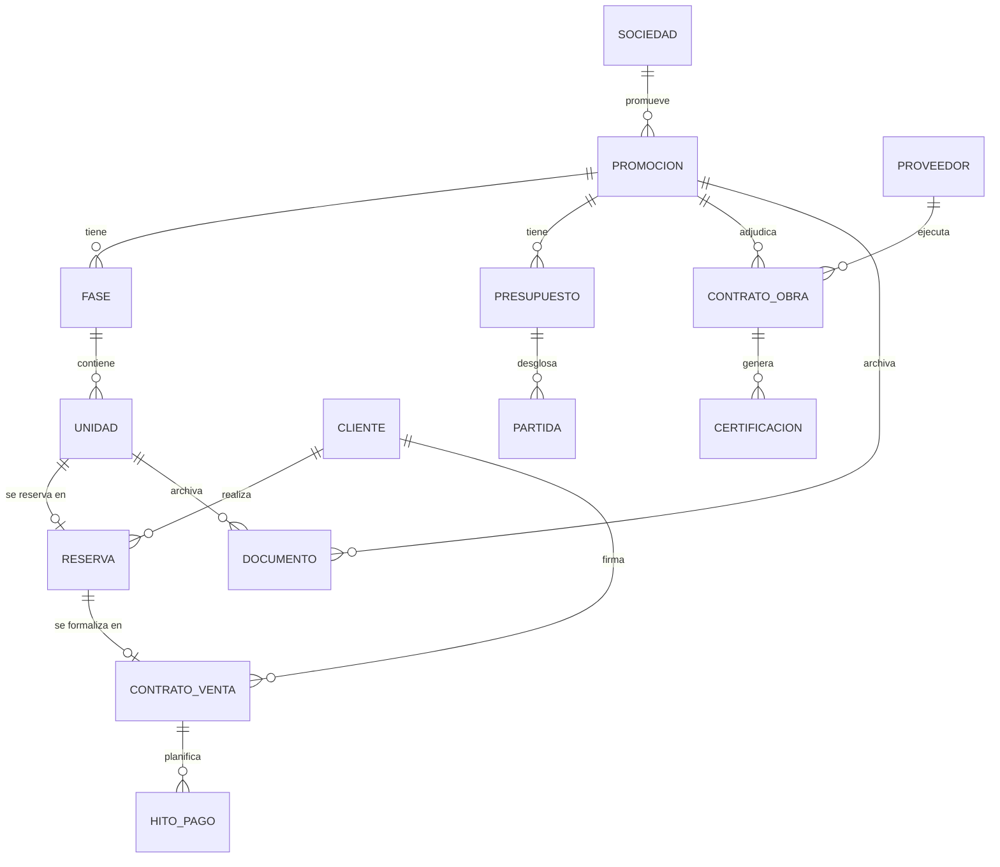

# Modelo de datos — ERP Grupo Tesela (Fase 0-1)

> Modelo relacional inicial sobre **PostgreSQL (Supabase)**.
> Cubre el núcleo: sociedades, promociones, obra, comercialización, terceros y enlace con Holded.
> Es un punto de partida para validar; se ampliará por módulos.

---

## 1. Diagrama entidad-relación (núcleo)



---

## 2. Esquema SQL (PostgreSQL)

```sql
-- ========= ORGANIZACIÓN =========
-- Una promoción suele ir en su propia sociedad (SPV). El grupo agrupa varias.
create table sociedad (
    id            uuid primary key default gen_random_uuid(),
    nombre        text not null,
    cif           text unique,
    holded_id     text,                 -- enlace al contacto en Holded
    creada_en     timestamptz default now()
);

-- ========= PROMOCIONES Y OBRA =========
create table promocion (
    id            uuid primary key default gen_random_uuid(),
    sociedad_id   uuid references sociedad(id),
    nombre        text not null,
    direccion     text,
    municipio     text,
    tipo          text check (tipo in ('residencial','terciario','mixto')),
    estado        text check (estado in ('suelo','proyecto','licencia','obra','entregada')) default 'suelo',
    fecha_inicio  date,
    fecha_fin_prev date,
    presupuesto_total numeric(14,2),
    creada_en     timestamptz default now()
);

create table fase (
    id            uuid primary key default gen_random_uuid(),
    promocion_id  uuid references promocion(id) on delete cascade,
    nombre        text not null,        -- "Fase 1", "Bloque A"...
    orden         int default 1
);

-- Unidad vendible: vivienda, local, garaje, trastero, parcela
create table unidad (
    id            uuid primary key default gen_random_uuid(),
    fase_id       uuid references fase(id) on delete cascade,
    referencia    text not null,        -- "A-1ºB", "GAR-12"
    tipo          text check (tipo in ('vivienda','local','garaje','trastero','parcela')),
    superficie_m2 numeric(8,2),
    precio_venta  numeric(12,2),
    estado        text check (estado in ('disponible','reservada','vendida','entregada')) default 'disponible',
    unique (fase_id, referencia)
);

-- ========= TERCEROS =========
create table cliente (
    id            uuid primary key default gen_random_uuid(),
    nombre        text not null,
    nif           text,
    email         text,
    telefono      text,
    holded_id     text,                 -- enlace al contacto en Holded
    attio_id      text,                 -- enlace al registro en Attio (CRM)
    creado_en     timestamptz default now()
);

create table proveedor (
    id            uuid primary key default gen_random_uuid(),
    nombre        text not null,
    cif           text,
    oficio        text,                 -- "estructura", "instalaciones"...
    holded_id     text,
    creado_en     timestamptz default now()
);

-- ========= COMERCIALIZACIÓN =========
create table reserva (
    id            uuid primary key default gen_random_uuid(),
    unidad_id     uuid references unidad(id),
    cliente_id    uuid references cliente(id),
    importe_senal numeric(12,2),
    fecha         date default current_date,
    estado        text check (estado in ('activa','convertida','cancelada')) default 'activa'
);

create table contrato_venta (
    id            uuid primary key default gen_random_uuid(),
    reserva_id    uuid references reserva(id),
    unidad_id     uuid references unidad(id),
    cliente_id    uuid references cliente(id),
    precio_total  numeric(12,2) not null,
    fecha_firma   date,
    holded_factura_id text,             -- factura asociada en Holded
    estado        text check (estado in ('arras','escriturado','resuelto')) default 'arras'
);

create table hito_pago (
    id            uuid primary key default gen_random_uuid(),
    contrato_id   uuid references contrato_venta(id) on delete cascade,
    concepto      text,                 -- "arras", "a cuenta", "fin de obra"
    importe       numeric(12,2),
    fecha_prev    date,
    pagado        boolean default false
);

-- ========= COSTES Y OBRA =========
create table presupuesto (
    id            uuid primary key default gen_random_uuid(),
    promocion_id  uuid references promocion(id) on delete cascade,
    version       int default 1,
    total         numeric(14,2)
);

create table partida (
    id            uuid primary key default gen_random_uuid(),
    presupuesto_id uuid references presupuesto(id) on delete cascade,
    capitulo      text,                 -- "Cimentación", "Estructura"...
    descripcion   text,
    importe_prev  numeric(14,2),
    importe_real  numeric(14,2) default 0
);

create table contrato_obra (
    id            uuid primary key default gen_random_uuid(),
    promocion_id  uuid references promocion(id),
    proveedor_id  uuid references proveedor(id),
    descripcion   text,
    importe_adjudicado numeric(14,2),
    estado        text check (estado in ('adjudicado','en_curso','finalizado')) default 'adjudicado'
);

create table certificacion (
    id            uuid primary key default gen_random_uuid(),
    contrato_obra_id uuid references contrato_obra(id) on delete cascade,
    numero        int,
    importe       numeric(14,2),
    fecha         date default current_date,
    holded_factura_id text               -- factura del proveedor en Holded
);

-- ========= DOCUMENTAL =========
create table documento (
    id            uuid primary key default gen_random_uuid(),
    promocion_id  uuid references promocion(id),
    unidad_id     uuid references unidad(id),
    tipo          text check (tipo in ('plano','licencia','escritura','contrato','foto','otro')),
    nombre        text not null,
    url_storage   text,                 -- ruta en Supabase Storage / Drive
    creado_en     timestamptz default now()
);
```

---

## 3. Notas de diseño

- **Enlace con Holded:** cada tabla de terceros y de facturación lleva un campo `holded_*_id` para sincronizar sin duplicar la contabilidad.
- **Enlace con Attio:** los clientes llevan `attio_id` para el seguimiento comercial (visitas, pipeline) en el CRM.
- **Rentabilidad por promoción:** se calcula cruzando `contrato_venta` (ingresos) con `partida.importe_real` + `certificacion` (costes reales que vienen de Holded).
- **Permisos (RLS):** en Supabase aplicaremos seguridad por fila para que cada usuario vea solo las promociones/sociedades que le correspondan (clave con 10 usuarios y roles distintos: dirección, obra, comercial).

---

## 4. Pendiente de ampliar (fases siguientes)

- Módulo de **postventa** (incidencias y garantías por unidad).
- Módulo de **proyectos de arquitectura** (encargos, honorarios, fases de diseño).
- Tabla de **usuarios y roles** detallada (se apoya en Supabase Auth).
- Tablas de **tesorería** consolidada (vista que combine Holded + hitos de pago).
